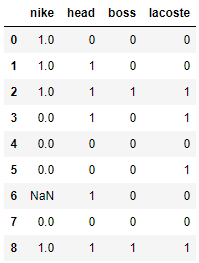
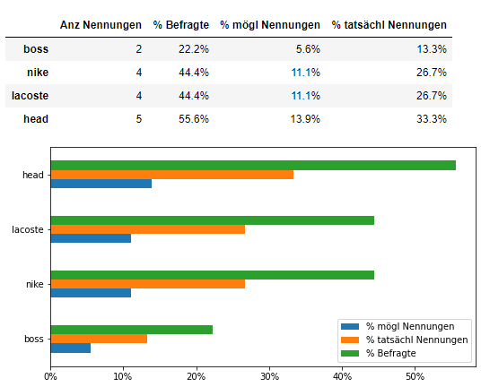
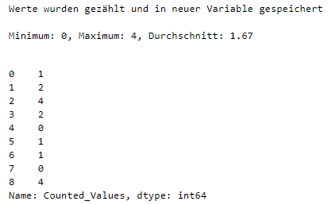
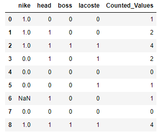

[](https://github.com/manfred2020/multiple-responses)
[](https://github.com/manfred2020/multiple-responses)
[](https://github.com/manfred2020/multiple-responses)
[](https://creativecommons.org/licenses/by-nc/4.0/)
[](https://github.com/manfred2020/multiple-responses)

# mr - multiple responses

Analysis of multiple responses - Auswertung von Mehrfachantworten

/ [Anwendungsbeispiel](#Anwendungsbeispiel-Funktion -mr()) / [Dokumentation](#Dokumentation-bzw-Hilfefunktion) /

<br>

### Anwendungsbeispiel Funktion mr()

```python
import pandas as pd # Import von Pandas, um anschließend das Datenfile zu importieren

data = pd.read_csv("C:\\YourFolder\\YourFile") # e.g. example file 'mehrfachantworten.csv'

data # Anzeige des importierten Dataframes
```



#### Ausgabe in Jupyter Notebook

Ein Standardaufruf (vgl. Beispieldatensatz *mehrfachantworten.csv*) der Funktion **mr()** mit
```python
from mr import mr # Import der Funktion 'mr' aus dem Modul (File) 'mr'

mr(data, "nike", "head", "boss", "lacoste")
```
ergibt in Jupyter Notebooks folgenden Output:



#### Ausgabe in Spyder IDE

Die Ausgabe der Grafik unterscheidet sich zwischen Jupyter Notebooks und der Ausgabe in Spyder nicht; jedoch sieht die Outputtabelle anders aus:


/ [zum Anfang](#readme) /

<br>

### Anwendungsbeispiel Funktion mr()

#### Ausgabe in Jupyter Notebook

Ein Standardaufruf (vgl. Beispieldatensatz *mehrfachantworten.csv*) der Funktion **cv()** mit
```python
from mr import cv # Import der Funktion 'cv' aus dem Modul (File) 'mr'

cv(data, "nike", "head", "boss", "lacoste")
```
ergibt in Jupyter Notebooks folgenden Output:





<br>

### Dokumentation bzw Hilfefunktion

Importiert man das komplette Modul **mr** und ruft dananch die Hilfefunktion **help()** auf
```python
import mr

help(mr)
```
so wird die vollständige Dokumentation des Moduls bzw. der darin enthaltenen Funktionen **mr()** und **cv()** angezeigt.

```
    Help on module mr:

NAME
    mr

DESCRIPTION
    Functions:
        mr - multiple response
        cv - count values
        
    Author:
        Manfred Hammerl
    
    https://github.com/manfred2020

FUNCTIONS
    cv(df, *col, count=1, var='Counted_Values')
        NAME:
            cv - count values
        
        DESCRIPTION:
            Eine kleine Funktion zur Zählung von Werten in einer oder mehreren Variablen
            und Speicherung des Zähl-Ergebnisses in einer neuen Variable
            
        Parameters:
            df : Dataframe
            col : string
                  Variablen, die in die Zählung einbezogen werden sollen
            count : int, float
                    Wert, der gezählt werden soll
            var : Name der neu zu erstellenden Variable, in welcher das Zähl-Ergebnis
                  gespeichert werden soll
        
        Returns:
            Anzeige der neue erstellten Variable
    
    mr(df, *col, count=1, save=False, decimal=',', style=True)
        NAME:
            mr - multiple response
        
        DESCRIPTION:
            Eine kleine Funktion zur Auswertung von Mehrfachantworten, welche
            ein Balkendiagramm ausgibt sowie eine Tabelle (Dataframe) mit den 
            Ergebnissen der Auswertung
            
        Parameters:
            df : Dataframe
            col : string
                  Variablen, die in die Auswertung einbezogen werden sollen
            count : int, float
                    Wert, der gezählt/ausgewertet werden soll
            save : bool
                   True: Outputtabelle wird in Zwischenablage kopiert
                   False: Outputtabelle wird nicht in Zwischenablage kopiert
                   (default)
            decimal : string
                      Nur in Verbindung mit 'save = True' relevant!
                      Dezimaltrennzeichen, bspw. "," (default) im deutschsprachigen Raum,
                      oder "." im englischsprachigen Raum
            style : bool
                  True: Wird die Funktion in einem Juypter Notebook aufgerufen, so
                        kann die "gestylte" Outputtabelle (Dataframe) angezeigt werden (default)
                  False: Wird die Funktion nicht in einem Jupyter Notebook aufgerufen,
                         sondern bspw. in Sypder, so wird damit eine "normale" Outputtabelle
                         (Dataframe) angezeigt.
        
        Returns:
            Dataframe

VERSION
    0.2.0, from 22nd February 2021
```

Importiert man nicht das komplette Modul, sondern eine einzelne Funktion (oder mit ***** alle Funktionen aus dem Modul), so kann man sich die Dokumentation für die einzelne Funktion anzeigen lassen.

```python
from mr import mr
# bzw.:
from mr import cv
# bzw.:
from mr import *

help(mr)
# bzw.:
help(cv)
```

```
Help on function mr in module mr:

mr(df, *col, count=1, save=False, decimal=',', style=True)
    NAME:
        mr - multiple response
    
    DESCRIPTION:
        Eine kleine Funktion zur Auswertung von Mehrfachantworten, welche
        ein Balkendiagramm ausgibt sowie eine Tabelle (Dataframe) mit den 
        Ergebnissen der Auswertung
        
    Parameters:
        df : Dataframe
        col : string
              Variablen, die in die Auswertung einbezogen werden sollen
        count : int, float
                Wert, der gezählt/ausgewertet werden soll
        save : bool
               True: Outputtabelle wird in Zwischenablage kopiert
               False: Outputtabelle wird nicht in Zwischenablage kopiert
               (default)
        decimal : string
                  Nur in Verbindung mit 'save = True' relevant!
                  Dezimaltrennzeichen, bspw. "," (default) im deutschsprachigen Raum,
                  oder "." im englischsprachigen Raum
        style : bool
              True: Wird die Funktion in einem Juypter Notebook aufgerufen, so
                    kann die "gestylte" Outputtabelle (Dataframe) angezeigt werden (default)
              False: Wird die Funktion nicht in einem Jupyter Notebook aufgerufen,
                     sondern bspw. in Sypder, so wird damit eine "normale" Outputtabelle
                     (Dataframe) angezeigt.
    
    Returns:
        Dataframe
```
```
Help on function cv in module mr:

cv(df, *col, count=1, var='Counted_Values')
    NAME:
        cv - count values
    
    DESCRIPTION:
        Eine kleine Funktion zur Zählung von Werten in einer oder mehreren Variablen
        und Speicherung des Zähl-Ergebnisses in einer neuen Variable
        
    Parameters:
        df : Dataframe
        col : string
              Variablen, die in die Zählung einbezogen werden sollen
        count : int, float
                Wert, der gezählt werden soll
        var : Name der neu zu erstellenden Variable, in welcher das Zähl-Ergebnis
              gespeichert werden soll
    
    Returns:
        Anzeige der neue erstellten Variable
```        

Die Dokumentation der Funktionen kann man sich auch mit ```mr.__doc__``` bzw. ```cv.__doc__``` ausgeben lassen.

/ [zum Anfang](#readme) /

<br>
<br>

<p xmlns:cc="http://creativecommons.org/ns#" xmlns:dct="http://purl.org/dc/terms/"><a property="dct:title" rel="cc:attributionURL" href="https://github.com/manfred2020/multiple-responses">mr - multiple responses</a> by <a rel="cc:attributionURL dct:creator" property="cc:attributionName" href="https://github.com/manfred2020">Manfred Hammerl</a> is licensed under <a href="http://creativecommons.org/licenses/by-nc/4.0/?ref=chooser-v1" target="_blank" rel="license noopener noreferrer" style="display:inline-block;">CC BY-NC 4.0</a></p>
