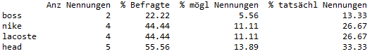

[](https://github.com/manfred2020/multiple-responses)
[](https://github.com/manfred2020/multiple-responses)
[](https://github.com/manfred2020/multiple-responses)
[](https://creativecommons.org/licenses/by-nc/4.0/)
[](https://github.com/manfred2020/multiple-responses)

# mr - multiple responses
Analysis of multiple responses - Auswertung von Mehrfachantworten


```python
import pandas as pd
from mr import mr

data = pd.read_csv("C:\\YourFolder\\YourFile.csv")

data

mr(data, "nike", "head", "boss", "lacoste")

```

##### Ausgabe in Jupyter Notebook


##### Ausgabe in Spyder IDE



##### Dokumentation bzw. Hilfefunktion

Durch die Eingabe von ```print(mr.__doc__)``` wird die Dokumentation der Funktion aufgerufen:

``` NAME:
        mr - multiple response
    
    DESCRIPTION:
        Eine kleine Funktion zur Auswertung von Mehrfachantworten, welche
        ein Balkendiagramm ausgibt sowie eine Tabelle (Dataframe) mit den 
        Ergebnissen der Auswertung
        
    Parameters:
        df : Dataframe
        col : string
              Variablen, die in die Auswertung einbezogen werden sollen
        count : int, float
                Wert, der gezählt/ausgewertet werden soll
        save : bool
               True: Outputtabelle wird in Zwischenablage kopiert
               False: Outputtabelle wird nicht in Zwischenablage kopiert
               (default)
        jup : bool
              True: Funktion wird in Juypter Notebook aufgerufen,
                    "gestylte" Outputtabelle (Dataframe) wird angezeigt (default)
              False: Funktion wird nicht in Jupyter Notebook aufgerufen, sondern
                     bspw. in Sypder.
                     "normale" Outputtabelle (Dataframe) wird angezeigt.
    
    Returns:
        Dataframe
```

Auch durch die Eingabe von ```help(mr)``` wird die Dokumentation angezeigt:

```
Help on function mr in module __main__:

mr(df, *col, count=1, save=False, jup=True)
    NAME:
        mr - multiple response
    
    DESCRIPTION:
        Eine kleine Funktion zur Auswertung von Mehrfachantworten, welche
        ein Balkendiagramm ausgibt sowie eine Tabelle (Dataframe) mit den 
        Ergebnissen der Auswertung
        
    Parameters:
        df : Dataframe
        col : string
              Variablen, die in die Auswertung einbezogen werden sollen
        count : int, float
                Wert, der gezählt/ausgewertet werden soll
        save : bool
               True: Outputtabelle wird in Zwischenablage kopiert
               False: Outputtabelle wird nicht in Zwischenablage kopiert
               (default)
        jup : bool
              True: Funktion wird in Juypter Notebook aufgerufen,
                    "gestylte" Outputtabelle (Dataframe) wird angezeigt (default)
              False: Funktion wird nicht in Jupyter Notebook aufgerufen, sondern
                     bspw. in Sypder.
                     "normale" Outputtabelle (Dataframe) wird angezeigt.
    
    Returns:
        Dataframe
```
        
        
<br>
<br>

<p xmlns:cc="http://creativecommons.org/ns#" xmlns:dct="http://purl.org/dc/terms/"><a property="dct:title" rel="cc:attributionURL" href="https://github.com/manfred2020/multiple-responses">mr - multiple responses</a> by <a rel="cc:attributionURL dct:creator" property="cc:attributionName" href="https://github.com/manfred2020">Manfred Hammerl</a> is licensed under <a href="http://creativecommons.org/licenses/by-nc/4.0/?ref=chooser-v1" target="_blank" rel="license noopener noreferrer" style="display:inline-block;">CC BY-NC 4.0</a></p>
